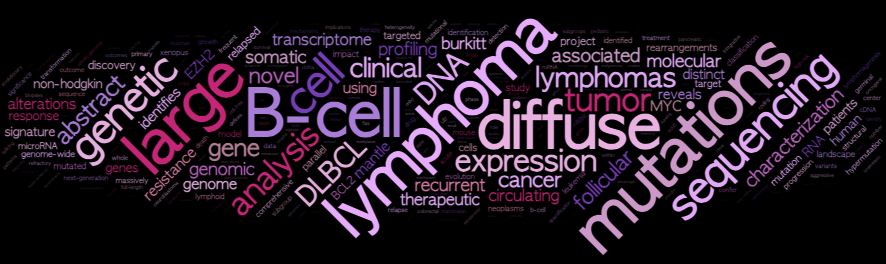

# Scholar Goggler


This R package will run a [Shiny](https://shiny.posit.co/) app that automatically generates word clouds using information it pulls from any public Google Scholar profile using the [Scholar package](https://github.com/jkeirstead/scholar). The public version of this app and its relatives can be found at the Scholar Goggler [homepage](https://scholargoggler.com/).

## Installation

### Option 1

First, install the package and its dependencies:
```
devtools::install_github("rdmorin/scholargoggler")
```
Then launch the Shiny app:
```
scholarGoggler()
```

### Option 2

Clone the repository:
```
git clone git@github.com:rdmorin/scholargoggler.git
```

Go to the newly created folder (or open the R project file) in Rstudio and run the code:

```
devtools::load_all()
scholarGoggler()
```

